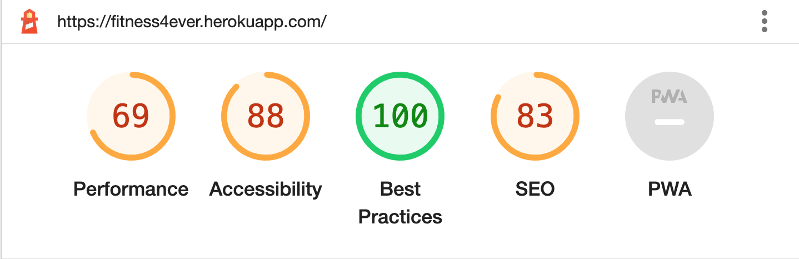

# Fitness4Ever

## README

#### Project Goals/Target Audience

Fitness4Ever is an online sports and fitness store, comprising of a a variety of gymwear, fitness nutrition and exercise advice sold in various forms. Designed around the basis that users would prefer to get all of their fitness and training information/products in one location. It's core function is to sell gymwear, protien nutrition and annual packages for nutrition and training advice, to boost users fitness wellbeing and goal achievment. Key to this is ease of use and quick navigation across the site, thus focus will be on displaying products in an appeasing and accessible way from the onset of the user journey into the site. Additionally the ability to browse the product collection via search, category and other metics is key this accessibilty and speed. From a monetary perspective providing users with the best experience is likely to achieve the highest revenues and so these goals are aligned.
 
Fitness4Ever is an online sports and fitness store, comprising of a a variety of gymwear, fitness nutrition and exercise advice sold in various forms. Designed around the basis that users would prefer to get all of their fitness and training information/products in one location. It's core function is to sell gymwear, protien nutrition and annual packages for nutrition and training advice, to boost users fitness wellbeing and goal achievment. Key to this is ease of use and quick navigation across the site, thus focus will be on displaying products in an appeasing and accessible way from the onset of the user journey into the site. Additionally the ability to browse the product collection via search, category and other metics is key this accessibilty and speed. From a monetary perspective providing users with the best experience is likely to achieve the highest revenues and so these goals are aligned.
 
The longterm goals of the site are to attract and maintain a loyal custom base with annual nutritiona and training plans that require annual payment upfront. This is also boost the ability to sell other products such as gymwear.
 
Fitness4Ever's target audience is recommended at ages 18+ to 60. The site will not cater to specific medical needs and so will not recommend exercised for those with bad backs, joints etc. However other than this the site is suitable to all genders, races, cultures and backgrounds who are able to engage in exercise safely.
  
Targeting those who like to keep their bodies fit and healthy and those seeking transformations is key. These individuals are likely to be disciplined and be repeat customers as their needs chnage/they require re-stock on perishables.

 
 

## User Experience

### User Goals

- Intuitively use and navigate site
- Discover quickly purpose of the site
- Discover quickly value/use of site to me
- Understand product and what they do for me
- Understand how protein and nutrition can help me
- Feel theres something to suit my needs now and in future
- Choose products/content I receive/pay for to suit my needs
- Easily signup and enter my information
- Save info for faster checkout
- Easily browse store products
- Easily purchase store products
- Intuitive shopping experience
- Choose annual fitness plans
 

### Developer Goals

- Simple to use UI
- Fluid user experience
- Low stress usage
- Aid users in reaching their fitness goals
- High compatibility/responsivness for user ease of access
- High user engagement
- High product sales
- High annual fittness sales
 

### User Stories

* First time User Goals

  - As a first time user, I want to easily ascertain the main purpose of the site and its value to me
   
  - As a first time user, I want to easily interact with the sites navigation and controls, visibly receiving feedback
   
  - As a first time user, I wish to be presented with new and exciting products to browse
   
  - As a first time user, I want to understand how products/plans can help me in my goals
   
  - As a first time user, I want to understand how nutrition can aid me
 
  - As a first time user, I wish to easily sign up and enter my information
   

* Returning User Goals
   
  - As a returning user I wish to choose products/content I pay for that suit my needs
   
  - As a returning user I want to easily browse the store and purchase products
   
  - As returning user I want to know if a longterm solution rather than individual pruchases is available
   

* Frequent User Goals
   
  - As a frequent user, I want to be able to order more swiftly from the site, not entering all details each time
   
  - As a frequent user I want to be able to edit my account details easily
   

* Developer Goals
   
   - As a developer, I want users to find the UI intuitive and easy to use
   
   - As a developer, I want users to find a fluid experience from signup to purchase
   
   - As a developer, I want user to feel little if at all stress in navigating the site
   
   - As a developer, I want to aid users in achieving their health and fitness goals
  
  - As a developer, I want the site to have high accessibility and responsiveness
 
  - As a developer, I want the site to have a high number of sales
   

## Design

### Design Choices

Beginning this stage by researching other available sports clothing/nutrition sites I began to make a list of desirable design features to be included. Top of the list was a way to process transactions/payments and generate a profit from the site, as this is the main purpose behind it. Second to this was navigation simplicity. The user journey needed to be targets and controlled to push the user towards products. However this couldn’t be at the expense of user experience.

Use of neutral coloured UI elements would be deployed to allow product images to have more impact, providing colour and the most interesting aspect of the page. Colours would be used to aid UI selection and to maintain accessibility.

Interactivity needed to be simple and precise, one should be able to understand site navigation and controls intuitively. The site is required to be fully responsive to all access from a variety of screen sizes/devices, all labels are appropriate and where a label hasn’t been used an aria-label has been, adhering to accessibility standards.

To fulfil the discovery and search aspect of the site a distinct search bar was devised and implemented to allow users to freely search all of the sites products. In addition to this the ability to filter products via various metrics is also included. Category, price, rating etc.

Users are able to sign up and save their details to a personal profile, this allows the user to quickly checkout with products, auto applying their preferred delivery method. They can update this at their discretion and also update with empty fields to delete this information.
 

### Data Design Choices

The first major step in the data design was to choose which kind of datatbase was best suited to this project. Major points for consideration were the amount of potential data queries that could be required over time, relationships between data models and highly important, security. I decided to choose a relational database or 'SQL'. This was based upon the high number of relationships the data would realistically have and the fact that future plans were to scale up site usage, users and therefore data queries and processing. Relational databases handle data quickly and can do so at scale whilst keeping multiple models and sensitive data secure. Drawbacks to this database include complex relationship models to consider when debugging features and also increased maintenance in comparison to non-relational ('no-SQL') databases.

The project is built using the Django web framework, this allows the use of a relational database and has several benifits. The ability to work on a local database during development for simplistic testing and feature creation. It enables the use of a production database of my choice that can be locally setup or setup withtin the cloud, effectively outsouring the server side functionality. On top of this Django is framework that enables the creation of apps with high levels of functionality in a short period of time using it's app based developement structure.

The DBMS I choose to host my database in production is PostgreSQL, with Amazon Web Services(AWS) for file hosting. Entirely server based, the systems hosted by Heroku and Amazon respectively don't require a local machine to store/query data. This suited my needs as I lacked the hardware to scale up a database myself. PostgreSQL stores product, user and order data whilst AWS is used to store and deliver all project static files. All database queries/model designs were written in Python3 and use the Django framework.

Users will interact with the UX and trigger backened python code that is communicated to heroku/postgreSQL to create, read, update and delete data on the server. Data integrity will be maintianed via input validation to ensure only clean expected data is input into the system, preventing errors/unexpected behaviour.

### Database Design

As postgreSQL is a relational database it makes use of models that are setup within django to define the data that the server will host. It uses fields that have their input/data-type specified. The use of foreign keys connects models where data is shared/reused and these relationships can be seen in the provided ERD.

Using Djangos app structure and data models, the resulting database is kept tidy with minimal redundancy and repetition. It also by design removes much of the need to normalise data as the separting of functions/features into apps demands each has a data model of to hand said data. As each model is designed to handle that function all data is defined once. Models can be created in one app and imported into another, removing the need to repeat and create redundncy/version control errors.

For this projetc there are five apps each with a model and these are all clearly shown in the ERD provided bellow.

##### Finalised Database Design

The final database structure displays the refinded relationships between Djangos modles(data definitions) and the Django apps. This is the data blueprint that is used in productiona as well as development regardless of use in postgreSQL or a local database.

As seen each model is defined with an id that acts as a primary key/foreign key. The datatbase design defined by the models of Django keeps the relationships clearly defined and onbviousy singular. There is little repition as model can be imported to other apps where necessary. Models exist to populate/take input from users, orders and securty details ie passwords.

For fast querying each model/database design is separated as to only process queries on modles necessary and reduce response time.

Also visible are the datatype and visual representations of the one to many relationship with the lines between tables.

[Data Model/Project ERD](media/readme/erd.png)

### Wireframes

The following wireframes were constructed within Balsamiq, during the Scope Plane section of the design and planning stage for this project. They represent an early design concept that has largely been kept to through to final product. However do note that they vary slightly from the final design, this is due to practical considerations that arose during the surface plane stage. Some design aspects were altered due to time constraints and practical limitations however I feel the main aim of the project has been realised.

[Homepage Dektop](media/readme/homepagedesktop.png)

[Homepage Mobile](media/readme/homepagemobile.png)

[Profile Desktop](media/readme/profiledesktop.png)

[Profile Mobile](media/readme/profilemobile.png)

[Store Desktop](media/readme/storedesktop.png)

[Store Mobile](media/readme/storemobile.png)

[Checkout Desktop](media/readme/checkoutdesktop.png)

[Checkout Mobile](media/readme/checkoutmobile.png)

### Colours

Colour has been used sparingly and with restrictions applied for specific purpose. The thought behind this is to have the only elements with colour on the page be selected/active nav/UI elements and products. By doing this the user is subtly guided into focusing on these areas which in turn will help aid intererst and sales.

This design spec was decided after research into the psychology of sales and publishing/webdesign.

### Fonts

Fonts used for the logo and page headers is 'Ubuntu'. This was choosen as a sharp and stylish font to appeal to a younger audience. Other fonts are defaults as they are fit for purpose.

### Styling

The general site layout is simple by design, drawing in the users attention with selective colour in areas of naviagtional/sales interest. Important information is left clear and unintruded.

All forms are clean and to the point, little styling makes it a simple affair to fill in the required fields and submit. Likewise editing user profile details follows the same suit. ALl forms have validation.

## Features

### Existing Features

- Login/Create Account
 
- Save delivery/profile information
 
- Edit profile information
 
- Delete profile information
 
- Fully Responsive
 
- View products details and ratings
 
- Add products to basket
 
- Clear/adjust basket quantity
 
- Process payments and take orders
 
- View order history
 
- Product search functionality
 
- Product filter functionality
 
- Login as admin
 
- Add products as admin
 
- Edit products as admin
 
- Delete products as admin

### Navigation Bar

Nav bar provides links to all pages and works interchangeably on all. It also provides host to the search functionality on all pages.

### Homepage

Providing the landing page users are welcomes to a clean layout of admin selected packages that are to be pushed for sales the most. Theu can navigate to all areas of the site from here and login/register.

### Store

Complete list of all products available on the site. Products can be filtered by category, price and rating.

### Checkout

This page is displayed once a user has completed their chekcout. Showing relevant details.

### Profile

Displaying users delivery details and order history.

### Payment Details

Displaying users delivery details and order history.

### Basket

Displaying products in the basket.

* Additional Features

  - Site is fully responsive

  - Contains interactive elements

  - Inter-page links for navigation

  - Use of backend data to manipulate DOM

  -  Modal/Flash alerts

 
### Bugs List - Check commits for BUG-comparison images

Following Django documentation and inbuilt data modeling practises there were minimal bugs that required attention during the development process. This is inherently a benifit of using a robust framework with a high level of built in functionality.

1. Code attempted to render shopping bag items from single quantity variable

- Fixed by changing variable to item_data for iteration

2. Checkout app caused error when processing delivery percentage decimal on single products

- added rounding function to solve

3. Add product without image through error as model.py expected img file

- add if statement to handle no image

4. Django local host wouldn’t allow hosting on local machine

- added 127.0.0.1 as allowed host

## Technologies Used

###Languages

- HTML5
- CSS
- Javascript
- jQuery
- Django templating syntax
- Python3

## Frameworks, Libraries & Programs Used

- VS code

    - Vs Code was used as the main editor for the project
   
- Bootstrap 4

    - Bootstrap 4 was used to assist in the layout, styling and responsiveness of the site
   
- Git

    - Git was used for version control by utilising the Gitpod terminal to commit and push to Github
   
- Gitpod

    - This was used a secondary editor when away from the main workstation
   
- GitHub
    - Used to store the projects code after being pushed from git
   
- Github desktop

    - Used to clone repositories from Github to local machine to work on
   
- Balsamiq

    - Used to create wireframes and plan design of site
   

- jQuery

    - Provided with Materialize to enable certain responsive elements such as navbar
 
-   Amazon Web Services

    - Platform used to serve static files to Heroku for production
 
-   Stripe Payment

    - Platform API used to process payments securely
 
- Heroku

    - Used to publish application
 
- Hackolade

    - Used to visualise database and relationships
 
- Django

    - Web framework used to build site data model framework
 
- Django Allauth

    - Library enabling creation of personal user accounts
 
- Django-environ

    - Enabled secure use of environment variables during development only
 
- postgreSQL

    - Database used within Heroku to host site data and return queries
 
- Tinyjpg
    - Used to compress image files to web appropriate file sizes
 
- pygraphviz
    - Used to generate Entity Relationship Diagram

## Testing

### Validator Testing

Using Djangos template language within .HTML files has proved to throw out the W3 validation, however instances of using this (and by extension Python) are the only errors shown.

CSS, JS and Python files were all collated for bulk validation.

CSS Validation

Javascript Validation

Python Validation

### Testing User Stories from User Experience (UX) Section

### User Goals

- Intuitively use and navigate site
- Discover quickly purpose of the site
- Discover quickly value/use of site to me
- Understand product and what they do for me
- Understand how protein and nutrition can help me
- Feel theres something to suit my needs now and in future
- Choose products/content I receive/pay for to suit my needs
- Easily signup and enter my information
- Save info for faster checkout
- Easily browse store products
- Easily purchase store products
- Intuitive shopping experience
- Choose annual fitness plans
 

### Developer Goals

- Simple to use UI
- Fluid user experience
- Low stress usage
- Aid users in reaching their fitness goals
- High compatibility/responsivness for user ease of access
- High user engagement
High product sales
High annual fittness sales
 

### User Stories

* First time User Goals

  - As a first time user, I want to easily ascertain the main purpose of the site and its value to me
    - From the homepage the user can clearly see the logo/name of the site and is immediatly shown a nav bar/products that are all fitness related
   
  - As a first time user, I want to easily interact with the sites navigation and controls, visibly receiving feedback
    - Nav buttons are interactive and provide hover and click feedback
   
  - As a first time user, I wish to be presented with new and exciting products to browse
    - The homepage is updates by admin and is used to showcase the latest products that have been choosen for a stronger sales push
   
  - As a first time user, I want to understand how products/plans can help me in my goals
    - Each product contains a description and information on what it is/can provide
   
  - As a first time user, I want to understand how nutrition can aid me
    -  Each product contains a description and information on what it is/can provide
 
  - As a first time user, I wish to easily sign up and enter my information
    - From any page on the site a user can signup and create an account entering their information
   

* Returning User Goals
   
  - As a returning user I wish to choose products/content I pay for that suit my needs
    - Products can be filtered via a number of categories to help users choose what is applicable to them. They can then add them to the basket and securely checkout
   
  - As a returning user I want to easily browse the store and purchase products
    - Browsing the store is a very simple navigational task aided by a simplistic UI. Products can be added to the bag and securely checked out in minutes using the Stripe API
   
  - As returning user I want to know if a longterm solution rather than individual pruchases is available
    - Annual packages can be purchased that provide a high number of other products that reduce the need to continually by smaller quantities
   

* Frequent User Goals
   
  - As a frequent user, I want to be able to order more swiftly from the site, not entering all details each time
    - Users prefered delivery addresses can be stored and entered automatically, reducing repetiton of data entry
   
  - As a frequent user I want to be able to edit my account details easily
  - Details can be updated and deleted easily by simply re-filling out the form data or clearing it and pressing update
   

* Developer Goals
   
   - As a developer, I want users to find the UI intuitive and easy to use
     - The UI can been designed with simplicity in mind to make it intuitive to use. This involves user feedback from buttons and having only necessary calls to action on the page
   
   - As a developer, I want users to find a fluid experience from signup to purchase
      - Browsing the store, adding products to the basket and then checking out with products can be done in minutes and requires a minimal amount of site navigation and clicking through pages
   
   - As a developer, I want users to feel little if at all stress in navigating the site
     - The simplistic UI couples with a logical navigation tree/few clicks to navigate pages/checkout make for a stress free experience
   
   - As a developer, I want to aid users in achieving their health and fitness goals
      - All products on the site provide either direct nutrition for specific goals, exercises for those goals or equipment to enable those goals
  
  - As a developer, I want the site to have high accessibility and responsiveness
     - The site is fully responsive from desktop to mobile and provides a provides alt tags, title tags and aria labels where necessary to ensure accessability
 
  - As a developer, I want the site to have a high number of sales
    - By providing an engaging and easy to use site populated with select useful products it can be hoped that this will generate a high number of sales
   

## Further Testing

### Black Box

This testng relates to final stage testing where most bugs have been removed. Bugs that remain are present due to time constraints. See design stage for bug reports and fixes.

Test No | Test Feature | Expected Result | Actual | Pass/Fail
------------ | ------------- | ------------ | ------------ | -------------
1 | Launch Site | Site loads homepage | | PASS |
2 | Check Navbar styling | Navbar styled correctly  | | PASS
3 | Homepage buttons | buttons in place | | PASS
4 | Font, size and style | Styled correctly | | PASS
5 | Signin button | Opens correct page | | PASS
6 | Register button | Loads correct page | | PASS
7 | Signin/Register form validation | Prompts user when invalid input provided | | PASS
8 | Adding items to basket | Items added to bakset | | PASS
9 | User profiles link | Leads to user profile | | PASS
10 | Search Bar | Search enables searching of sites recipes | | PASS
11 | Update User Details | User can update own details on profile | | PASS
12 | Delete user details | Updating empty fields clears user data | | PASS
13 | Edit basket | Items deleted/quantity adjusted | | PASS
14 | Feedback alert boxes | Feedback provided for login/logout, sighnup, basket update, successful/unsuccsessful checkout | | PASS
15 | Product details page | Clicking product opens details page | | PASS
16 | Filtering products via metrics eg category, rating, price | All metrics successfully filter products | | PASS
17 | Logging in as admin provide options to delete, add, update products | Admin login displays correct options | | PASS
18 | Successful product update | Product updates | | PASS
19 | Site navbar links | Links function as expected | | PASS
20 | Successful product deletion | Product deleted | | PASS
21 | Successful product creation | Product added | | PASS

### Browsers
 - The site was tested on Google Chrome, Edge, Safari and Mozilla Firefox

### Lighthouse
 - Testing using lighthouse took place in chrome with these results

Performance here is less than ideal. After some investigation this metric drop is caused by slow load times of images from Amaon Web Services. Due to the use of a free account web traffic has speed limitations. Tiny JPEG was used to decrease file size of static image files to slightly increase the score to 69 from 56, as shown in the image above.

### Devices
 - The site was tested on a variety of devices including a MacBook Pro, Dell Desktop, iPhone 11, iPad and Samsung Galaxy S20.

### Friends/Family Users
 - Family members and friends took part in testing using the site and informed of any bugs encountered.

### Known Bugs

 - All known bugs and issues have been resolved.
   

## Deployment

### Forking the GitHub Repository

Forking the Github repository makes a copy of the original repository on our GitHub account. We can then view and/or make changes without affecting the original repository.

1. Log in to GitHub and locate the GitHub Repository
2. At the top of the Repository locate the "Fork" Button
3. You should now have a copy of the original repository in your GitHub account

### Clone to desktop

1. Donwload Github Desktop
2. Log in to GitHub and locate the GitHub Repository
3. Under the repository name, click "Clone to dektop".
4. Github dektop will ask you if you want to clone, click "Yes"
5. Click "Open in editor"
6. You have now cloned the project to your local machine
7. Take note of requirements.txt for requirements

### Gitpod Clone

1. Download the gitpod chrome extension
2. Locate the repository on Github
3. On the righthand side of the menu bar choose "Gitpod"
4. Login to Gitpod using your Github account or make a new Gitpod account
5. You have now opened a new workspace within gitpod
6. The repository is cloned to your Github
7. Take note of requirements.txt for requirements
8. No env variables will be present, please see settings.py to find required variables and set these to your own setup/needs. You can set env variables within gitpods settings or CLI

### Setting Up Django

Project must be cloned to desired location before completing this step

1. Once the project is cloned into the desired workspace, you will need all project requirements
2. Key to this is Django, while other requirements/libraries may be substituted, this cannot.
3. Install all requirements from requirements.txt and you Django should install during this process

###Deploy To Heroku
1. Login to Heroku and create new app
2. Go to deploy and connect github account to Heroku
3. Go to access and add collaborator
4. Go to settings and reveal config vars. Here specify required variables which can be found in setting.py. This will include Amazon Web Services/Stripe keys details bellow
5. Once all env's are within config vars, you can deploy the project

## Security

This app uses AllAuth to manage login/signup and has it's own built in security measures to ensure safety in this process. Stripe API has been used to process payments over a secure https connection to their servers where data is processed securely and then deleted. Webhooks have been employed to prevent processing of payments if an order doesn't process properly.

##Assets List

This is a git generated list of all files within the repository. As the project is large in size and contains hundreds of different files I opted for an automated solution. This is an effort to be time efficient as manually creating this list would have taken an enourmous number of hours/days.

Open to view Complete Asset List

|Asset Name|
|---|---|---|---|
|.DS_Store|
|:----|
|.gitignore|
|.gitpod.dockerfile|
|.gitpod.yml|
|.vscode/MAINTAINERS.md|
|.vscode/arctictern.py|
|.vscode/client.cnf|
|.vscode/font_fix.py|
|.vscode/heroku_config.sh|
|.vscode/init_tasks.sh|
|.vscode/launch.json|
|.vscode/make_url.py|
|.vscode/mysql.cnf|
|.vscode/rmdep.sh|
|.vscode/settings.json|
|.vscode/start_mysql.sh|
|.vscode/upgrades.json|
|.vscode/uptime.sh|
|.vscode/version.txt|
|Procfile|
|bag/__init__.py|
|bag/admin.py|
|bag/apps.py|
|bag/contexts.py|
|bag/migrations/__init__.py|
|bag/models.py|
|bag/templates/bag/bag.html|
|bag/templatetags/__init__.py|
|bag/templatetags/bag_tools.py|
|bag/tests.py|
|bag/urls.py|
|bag/views.py|
|checkout/__init__.py|
|checkout/admin.py|
|checkout/apps.py|
|checkout/forms.py|
|checkout/migrations/0001_initial.py|
|checkout/migrations/0002_auto_20220618_1000.py|
|checkout/migrations/0003_alter_order_country.py|
|checkout/migrations/0004_order_user_profile.py|
|checkout/migrations/__init__.py|
|checkout/models.py|
|checkout/signals.py|
|checkout/static/checkout/css/checkout.css|
|checkout/static/checkout/js/stripe_elements.js|
|checkout/templates/checkout/checkout.html|
|checkout/templates/checkout/checkout_success.html|
|checkout/templates/checkout/confirmation_emails/confirmation_email_body.txt|
|checkout/templates/checkout/confirmation_emails/confirmation_email_subject.txt|
|checkout/tests.py|
|checkout/urls.py|
|checkout/views.py|
|checkout/webhook_handler.py|
|checkout/webhooks.py|
|custom_storages.py|
|fitness4ever/__init__.py|
|fitness4ever/asgi.py|
|fitness4ever/settings.py|
|fitness4ever/urls.py|
|fitness4ever/wsgi.py|
|home/__init__.py|
|home/admin.py|
|home/apps.py|
|home/migrations/0001_initial.py|
|home/migrations/__init__.py|
|home/models.py|
|home/templates/home/index.html|
|home/tests.py|
|home/urls.py|
|home/views.py|
|manage.py|
|media/WhatsApp_Image_2022-06-12_at_12.28.20_PM.jpeg|
|media/WhatsApp_Image_2022-06-12_at_12.28.20_PM_AVRSNwb.jpeg|
|media/bulk_pro.jpg|
|media/exercise_shoes.jpg|
|media/lean_pro.jpg|
|media/mens_shorts.jpg|
|media/noimage.jpg|
|media/readme/fitness4evermockup.png|
|media/ul_womens_top.jpg|
|media/weight_pro.jpg|
|media/womens_bra.jpg|
|media/womens_shorts.jpeg|
|profiles/__init__.py|
|profiles/admin.py|
|profiles/apps.py|
|profiles/forms.py|
|profiles/migrations/0001_initial.py|
|profiles/migrations/__init__.py|
|profiles/models.py|
|profiles/static/profiles/css/profile.css|
|profiles/static/profiles/js/countryfield.js|
|profiles/templates/profiles/profile.html|
|profiles/tests.py|
|profiles/urls.py|
|profiles/views.py|
|readme.md|
|requirements.txt|
|static/css/base.css|
|store/__init__.py|
|store/admin.py|
|store/apps.py|
|store/fixtures/categories.json|
|store/fixtures/store.json|
|store/forms.py|
|store/migrations/0001_initial.py|
|store/migrations/0002_rename_product_store.py|
|store/migrations/0003_alter_store_price.py|
|store/migrations/0004_alter_category_options.py|
|store/migrations/0005_store_has_sizes.py|
|store/migrations/__init__.py|
|store/models.py|
|store/templates/store/add_products.html|
|store/templates/store/custom_widget_templates/custom_clearable_file_input.html|
|store/templates/store/edit_product.html|
|store/templates/store/includes/quantity_script.html|
|store/templates/store/item_detail.html|
|store/templates/store/store.html|
|store/tests.py|
|store/urls.py|
|store/views.py|
|store/widgets.py|
|templates/.DS_Store|
|templates/allauth/account/account_inactive.html|
|templates/allauth/account/base.html|
|templates/allauth/account/email.html|
|templates/allauth/account/email/email_confirmation_message.txt|
|templates/allauth/account/email/email_confirmation_signup_message.txt|
|templates/allauth/account/email/email_confirmation_signup_subject.txt|
|templates/allauth/account/email/email_confirmation_subject.txt|
|templates/allauth/account/email/password_reset_key_message.txt|
|templates/allauth/account/email/password_reset_key_subject.txt|
|templates/allauth/account/email_confirm.html|
|templates/allauth/account/login.html|
|templates/allauth/account/logout.html|
|templates/allauth/account/messages/cannot_delete_primary_email.txt|
|templates/allauth/account/messages/email_confirmation_sent.txt|
|templates/allauth/account/messages/email_confirmed.txt|
|templates/allauth/account/messages/email_deleted.txt|
|templates/allauth/account/messages/logged_in.txt|
|templates/allauth/account/messages/logged_out.txt|
|templates/allauth/account/messages/password_changed.txt|
|templates/allauth/account/messages/password_set.txt|
|templates/allauth/account/messages/primary_email_set.txt|
|templates/allauth/account/messages/unverified_primary_email.txt|
|templates/allauth/account/password_change.html|
|templates/allauth/account/password_reset.html|
|templates/allauth/account/password_reset_done.html|
|templates/allauth/account/password_reset_from_key.html|
|templates/allauth/account/password_reset_from_key_done.html|
|templates/allauth/account/password_set.html|
|templates/allauth/account/signup.html|
|templates/allauth/account/signup_closed.html|
|templates/allauth/account/snippets/already_logged_in.html|
|templates/allauth/account/verification_sent.html|
|templates/allauth/account/verified_email_required.html|
|templates/allauth/base.html|
|templates/allauth/socialaccount/authentication_error.html|
|templates/allauth/socialaccount/base.html|
|templates/allauth/socialaccount/connections.html|
|templates/allauth/socialaccount/login_cancelled.html|
|templates/allauth/socialaccount/messages/account_connected.txt|
|templates/allauth/socialaccount/messages/account_connected_other.txt|
|templates/allauth/socialaccount/messages/account_connected_updated.txt|
|templates/allauth/socialaccount/messages/account_disconnected.txt|
|templates/allauth/socialaccount/signup.html|
|templates/allauth/socialaccount/snippets/login_extra.html|
|templates/allauth/socialaccount/snippets/provider_list.html|
|templates/base.html|
|templates/includes/main-nav.html|
|templates/includes/mobile-top-header.html|
|templates/includes/toasts/toast_error.html|
|templates/includes/toasts/toast_info.html|
|templates/includes/toasts/toast_success.html|
|templates/includes/toasts/toast_warning.html|

## Credits

### Code
https://docs.djangoproject.com/en/4.1/
Used for guidance on Django framework

https://stripe.com/docs/api
Used for guidance on Stripe API

### Content
All text content was written by myself

### Media
https://www.pexels.com
Royalty free stock images

kaggle.com
Royalty free stock images

## Ackhnowledgements
 - Patrick Justus
 - Harlow College
 - Code Institute
